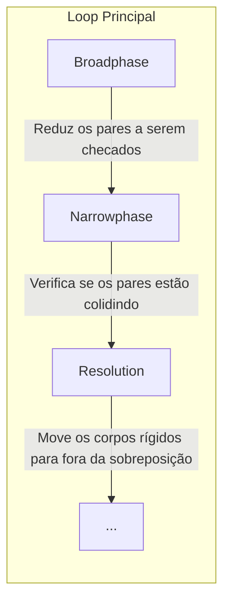

Desde os primórdios do desenvolvimento de jogos, os motores de física têm sido um componente crucial. Eles simulam o comportamento realista de objetos no mundo virtual, replicando fenômenos como gravidade, fricção, colisão e resposta a forças externas. Essa simulação aprimora a imersão do jogador, alinhando a mecânica do jogo com a física do mundo real.

Apesar da internet ser um vasto repositório de informações, o conteúdo em português sobre motores de física é surpreendentemente escasso. Isso pode ser um desafio para entusiastas e estudantes que desejam aprender, mas enfrentam barreiras linguísticas.

Com isso em mente, decidi criar esta série de posts. Meu objetivo é aglutinar o meu conhecimento sobre motores de física em uma série didática, tornando-o acessível para falantes de português. Pretendo que este seja um recurso útil, repleto de exemplos práticos, intuitivos e dinâmicos que facilitam a compreensão dos conceitos.

Lembro, ainda, que este não é um trabalho formal ou acadêmico. Longe disso. É um esforço pessoal para produzir posts informais que visam praticidade e acessibilidade. Afinal, acredito fortemente nos preceitos do Paulo Freire, que defendia a educação como um processo libertador e acessível a todos. Deste modo, pretendo, mesmo que de forma modesta, contribuir para a democratização do conhecimento ao passo que também aprendo e me aprimoro.

> Este trabalho é baseado em cursos, livros e tutoriais que estudei no passado. Estou compartilhando o que aprendi com vocês e, ao longo da série, fornecerei recursos e referências para que vocês possam expandir ainda mais o conhecimento. **Encorajo fortemente** que vocês busquem outras fontes de informação também, para ter uma compreensão mais ampla e diversificada sobre motores de física. Afinal, a aprendizagem é uma jornada contínua.
{: .prompt-info}

> For those who don't speak Portuguese, I'm planning to translate this series to English in the future. I just don't see it as a priority right now, as there are already a lot of resources in English about game physics. But if you're interested, let me know and I'll prioritize the translation.
{: .prompt-info}

# Metodologia

Esta série será conduzida em várias fases, cada uma focada em um aspecto específico do motor físico. A metodologia adotada é uma combinação de teoria e prática, permitindo uma compreensão abrangente dos conceitos e sua aplicação em cenários práticos.

Aqui está um resumo do que vocês podem esperar:

- **Teoria**: Cada post começará com uma discussão teórica. Vou explicar os conceitos fundamentais, definir terminologias importantes e discutir os tópicos relevantes. O objetivo é construir uma base sólida de conhecimento que possa ser aplicada em várias situações.

- **Prática**: Após a discussão teórica, vamos mergulhar na prática. Vou lhe mostrar como os conceitos teóricos podem ser aplicados na vida real. Isso pode incluir a implementação de exemplos práticos, análise de código-fonte, ou discussão sobre boas práticas e otimizações.

- **Exercícios**: Além disso, ao final de cada post, forneceremos exercícios para que você possa praticar e aprimorar o conhecimento adquirido. A prática é fundamental para a compreensão e retenção de conhecimento, e os exercícios são uma excelente forma de aplicar o que você aprendeu.

Porém, não se engane com a minha maneira formal de falar. Não sou um professor, e sim um puro entusiasta. Portanto, não espere uma abordagem acadêmica ou academicista. Meu objetivo é tornar o conteúdo acessível e prático, com a finalidade de dispertar sua curiosidade e te ajudar a aprender de forma dinâmica. Aqui, estamos de igual para igual, aprendendo juntos.

# Pensamentos Introdutórios

Antes de mergulharmos nos detalhes, vamos começar com algumas reflexões introdutórias. Vamos definir o que é um motor de física, discutir sua importância e porquê você deveria se importar com isso.

#### O que é um Motor de Física?

Um motor de física é um software que simula o comportamento de objetos no mundo virtual. Ele é responsável por replicar fenômenos físicos, como gravidade, fricção, colisão e resposta a forças externas.

Os motores de física são usados em jogos, simulações e aplicativos interativos para criar uma experiência mais realista e imersiva, como já mencionado.

##### E um motor de física customizado?

Há diversos motores de física disponíveis no mercado, como [Box2D], [Bullet], [Havok], [PhysX], [Ode], [Newton], [Chipmunk], [Matter.js], [Cannon.js], [P2.js], ... e a lista segue. Porém, é perfeitamente possível criar um motor de física customizado, seja por necessidade, curiosidade ou diversão.

Uma das principais necessidades de um motor de física customizado é a sua flexibilidade e adaptabilidade ao motor de jogo em questão.

#### Por que os Motores de Física customizados são importantes?

Os motores de física customizados são importantes por uma série de razões. Aqui estão algumas delas:

- **Personalização**: Eles permitem que os desenvolvedores ajustem e modifiquem o motor para atender às necessidades específicas de seu jogo. Isso pode resultar em uma experiência de jogo mais única e envolvente.

- **Otimização**: Com um motor de física customizado, os desenvolvedores podem otimizar o desempenho para seu jogo específico, melhorando a eficiência e a velocidade.

- **Inovação**: Motores de física customizados podem permitir a implementação de mecânicas de jogo inovadoras que não seriam possíveis com motores de física padrão.

#### Quando não usar um Motor de Física customizado?

Apesar de os motores de física serem poderosos, eles não são uma solução mágica e nem tão abrangentes quanto se poderia esperar. Eles têm suas limitações e desafios, e é importante entender esses aspectos para usá-los de forma eficaz. Por exemplo, em um jogo que necessita de um comportamento físico muito específico, ou em casos similares, a codificação direta pode ser mais eficiente e prática, poupando recursos humanos e computacionais.

No entanto, motores de física customizados podem ser complexos e difíceis de entender. Eles requerem um bom entendimento de matemática, física e programação de baixo nível, e tendem a ser bastante desafiadores para iniciantes. Por isso, é importante avaliar se a construção de um motor de física próprio é a melhor solução para o seu problema.

Existem abordagens alternativas, como a codificação direta, também conhecida como "hardcoded", que podem ser mais eficientes em alguns casos - seja por serem extremamente especializadas, ou por serem mais eficientes computacionalmente, dado que motores de física são, por natureza, mais custosos computacionalmente.

Imagine criar uma ferramenta tão flexível que pretende abranger a maior quantidade de casos possíveis. Ela será, portanto, mais custosa computacionalmente do que uma ferramenta especializada, que atende a um caso específico.

# Terminologias Importantes

Para não se sentirem perdidos, vamos começar com algumas definições de suma importância. As utilizarei ao longo da série, então é importante que vocês as compreendam bem.

#### **Corpo Rígido (Rigid-Body)**  
Um corpo rígido é um objeto idealizado que não se deforma ou se dobra. Em jogos e simulações, são usados pelo motor de física para representar objetos que se movem e colidem uns com os outros.

Um típico corpo rígido é definido por sua posição, orientação, velocidade linear, velocidade angular, massa, inércia e forma.

> Em futuros posts, falarei mais sobre estes campos e alguns outros que não estão listados aqui, como inverso da massa, inverso da inércia, forças, torques, e assim por diante.
{: .prompt-info}

#### **Colisor (Collider)**  
Um colisor é uma forma geométrica atribuída a um corpo rígido que define a área dentro da qual ocorre a detecção de colisão. Pode ser uma caixa, esfera, cápsula ou malha personalizada.

Escolhemos o colisor com base na forma do corpo rígido que ele representa, mas aplicamos formas geométricas mais simples para simplificar a detecção de colisão, uma vez que suas regras matemáticas são mais fáceis de lidar e computacionalmente mais eficientes.

> Collider é uma terminologia comum em motores de física como Unity e Unreal Engine. Em outros motores, como [Box2D], o termo é _**Fixture**_.
{: .prompt-tip}

#### **Colisão (Collision)**  
Uma colisão ocorre quando dois colisores se sobrepõem ou estão em contato em ao menos um ponto. A detecção de colisão é uma das tarefas mais importantes de um motor de física, pois é responsável por detectar quando dois corpos rígidos estão dde fato fisicamente interagindo.

A problemática da colisão gira em torno na definição do _**quando**_ e _**onde**_ a colisão ocorre entre dois colisores.

#### **Contato (Contact)**  
Pontos de contato, ou apenas contatos, que foram detectados durante a colisão. Ele fornece informações detalhadas sobre como os corpos rígidos interagem, bem como pontos de contato, normais, profundidades de penetração e outros detalhes.

#### **Contact Manifold**  
O contact manifold é um conjunto de pontos de contato que foram detectados durante a colisão. Ele fornece informações detalhadas sobre como os corpos rígidos interagem.

# Etapas da detecção de colisão

Agora que entendemos as terminologias básicas, vamos dar uma olhada nas etapas que um motor de física percorre para simular o comportamento desejado.

Tipicamente, um motor de física percorre três etapas principais:

Mais detalhadamente, as etapas são:

1. ##### **Broadphase**  
    Esta é a primeira etapa da detecção de colisão. Ela é responsável por reduzir o número de pares de colisão que precisam ser verificados. Isso pode ser feito dividindo o espaço em regiões menores e verificando quais corpos rígidos estão em cada região. Se dois corpos rígidos não estão na mesma região, eles não podem estar colidindo, então não precisamos verificar a colisão entre eles.

    Em contraposição, imagine que temos 1000 corpos rígidos em cena. Se verificarmos a colisão entre todos os pares de corpos rígidos, teríamos que verificar 1000 * 1000 = 1.000.000 pares de colisão - o que é muito ineficiente e custoso para cada quadro do jogo. A broadphase nos ajuda a reduzir esse número para algo mais gerenciável, transformando um algorítimo de execução O(n^2) em algo mais próximo de O(n log n).

    Nesta fase, é perfeitamente aceitável que a broadphase nos dê falsos positivos, ou seja, pares de corpos rígidos que não estão colidindo, mas que a broadphase acha que estão. Isso é aceitável porque a próxima etapa, a narrowphase, verificará se esses pares estão de fato colidindo.

2. ##### **Detecção de Colisão (Narrowphase)**  
    A narrowphase é a segunda etapa da detecção de colisão. Ela é responsável por verificar se os pares de corpos rígidos que a broadphase nos deu são de fato colidindo. Ela nos dá uma resposta definitiva sobre se dois corpos rígidos estão colidindo ou não.

    A narrowphase é onde a forma dos colisores é levada em consideração. Ela verifica se as formas dos colisores se sobrepõem ou estão em contato, e se estão, ela nos dá informações detalhadas sobre a colisão, como pontos de contato, normais, profundidades de penetração e outros detalhes.

3. ##### **Resolução de Colisão (Resolution)**  
    A resolução de colisão é a etapa onde os corpos rígidos são movidos para fora da sobreposição e os contatos são resolvidos. Isso pode envolver a aplicação de forças e torques para mover os corpos rígidos para fora da sobreposição, ou a aplicação de impulsos para separar os corpos rígidos.

    A resolução de colisão é uma etapa muito importante, pois é responsável por garantir que os corpos rígidos não fiquem sobrepostos e que as forças e torques sejam aplicados corretamente para mover os corpos rígidos para fora da sobreposição.

> Há motores que dividem em ainda mais etapas, como a detecção de colisão em si, a resolução de colisão, a integração de velocidade e a integração de posição. Mas para fins didáticos, vamos nos ater a estas três etapas principais.
{: .prompt-info}

# Conclusão

Após estes entendimentos básicos, estamos prontos para mergulhar mais fundo no mundo dos motores de física. Nos próximos posts, abordarei tópicos como detecção de colisão, resolução de colisão, integração de velocidade e posição, e muito mais.

Por hora, espero que vocies já consigam definir alguns conceitos e delimitar as etapas de um motor de física.

# Exercícios

1. **Reflexão sobre Motores de Física**: Com base no que você aprendeu neste post, escreva um parágrafo descrevendo o que você entende por "motor de física". Como você explicaria isso para alguém que nunca ouviu falar sobre isso antes?

2. **Aplicações Práticas**: Pense em um jogo ou aplicativo que você gosta. Como você acha que os motores de física são usados nele? Escreva suas ideias e explique por que você acha que eles usam motores de física dessa maneira.

3. **Pesquisa Adicional**: Escolha uma das referências recomendadas no final do post e passe algum tempo explorando-a. Escreva um resumo do que você aprendeu e como isso se relaciona com o que foi discutido neste post.

4. **Pensamento Crítico**: Se você fosse projetar seu próprio motor de física, quais seriam as características mais importantes para você? Por quê? Como você abordaria a detecção e resolução de colisões?

5. **Expansão do Conhecimento**: Agora que você tem uma compreensão básica dos motores de física, que outros tópicos relacionados você está interessado em aprender? Faça uma lista e explique por que cada tópico é de interesse para você.

# Expandindo o Conhecimento

Agora que entendemos as terminologias básicas e as etapas de um motor de física, é hora de expandir o conhecimento. Aqui estão algumas referências que recomendo fortemente para quem deseja aprofundar o conhecimento em motores de física:

- O [Curso '2D Game Physics Programming' por Pikuma] é uma excelente opção para quem deseja aprofundar o conhecimento em motores de física. Ele aborda tópicos como detecção de colisão, resolução de colisão, e muito mais. O que me fascina é a didática do curso, que é muito clara e acessível, mesmo para quem não tem experiência prévia com física, matemática ou programação.

- A [série de posts do Ming-Lun "Allen" Chou] é uma excelente leitura para quem deseja aprofundar o conhecimento em motores de física. Ele aborda de forma genérica (e por sua vez mais avançada e genial) alguns tópicos de motores de física, além do que ele próprio é um integrante da equipe de desenvolvimento da Naughty Dog, o que por si só já é um grande diferencial.

- Recomendo, assim que estiver confortável com os conceitos básicos e avançados, a leitura do livro ['Game Physics Engine Development' por Ian Millington]. Ele é um dos melhores livros que já li sobre motores de física, e aborda tópicos introdutórios e avançados de forma clara e acessível.

- Outra recomendação é o estudo sobre o código-fonte de motores de física como [Box2D]. A leitura do código-fonte de motores de física, ou de qualquer outro software, é uma excelente forma de aprender sobre como as coisas funcionam na prática.

[//]: (Externals)
[Box2D]: https://box2d.org/
[Bullet]: https://pybullet.org/wordpress/
[Havok]: https://www.havok.com/
[PhysX]: https://developer.nvidia.com/physx-sdk
[Ode]: https://www.ode.org/
[Newton]: https://newtondynamics.com/
[Chipmunk]: https://chipmunk-physics.net/
[Matter.js]: https://brm.io/matter-js/
[Cannon.js]: https://schteppe.github.io/cannon.js/
[P2.js]: https://schteppe.github.io/p2.js/
[Curso '2D Game Physics Programming' por Pikuma]: https://pikuma.com/courses/game-physics-engine-programming/
[série de posts do Ming-Lun "Allen" Chou]: https://allenchou.net/game-physics-series/
['Game Physics Engine Development' por Ian Millington]: https://www.amazon.com/Game-Physics-Engine-Development-Commercial-Grade/dp/0123819768
[//]: (EOF)
